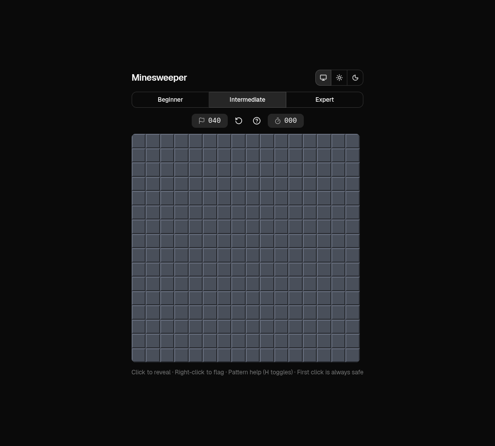

# Minesweeper

Classic Minesweeper in the browser: left-click to reveal, right-click to flag, three difficulties, and a timer. Built with **React**, **TypeScript**, **Tailwind CSS**, and **Vite+** (Vite-based toolchain).



## Play

- **Reveal** a hidden square — left-click (or tap).
- **Flag** a suspected mine — right-click (or long-press on touch devices).
- **New game** — reset with the same difficulty.
- **Pattern help** — click the help icon or press **`H`** to open a hint when a logical move exists. The board highlights the relevant cells; after you close the dialog, highlights stay for a few seconds so you can act on them.
- **Theme** — light, dark, or follow the system setting.

The first reveal is always safe: mines are placed after you click, avoiding your cell and its neighbors.

## Development

This repo uses **Vite+** (`vp`) as the unified toolchain. Use `vp` for install, dev, build, test, and lint — not raw `pnpm`/`npm` for package changes (see `AGENTS.md` in the project).

```bash
vp install          # dependencies
vp dev              # dev server (same options as Vite)
vp check            # format, lint, TypeScript
vp test             # Vitest
vp build            # production build
```

Custom `package.json` scripts named `dev` / `build` exist for compatibility; `vp dev` / `vp build` invoke the toolchain directly.

## Project layout

| Path              | Role                                                            |
| ----------------- | --------------------------------------------------------------- |
| `src/game.ts`     | Core game logic and rules                                       |
| `src/hints.ts`    | Deducible-move hints (basic counting, pairwise overlap / 1–2–1) |
| `src/App.tsx`     | UI, theme, help dialog, and board                               |
| `src/components/` | Hint copy, region preview, shadcn UI pieces                     |
